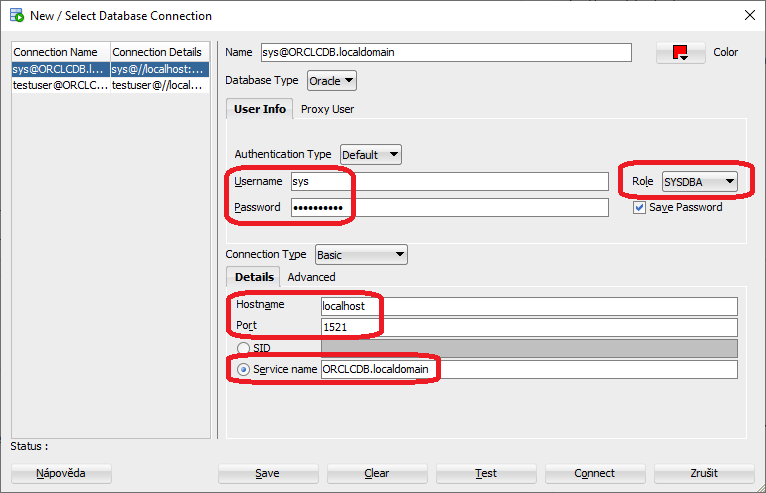
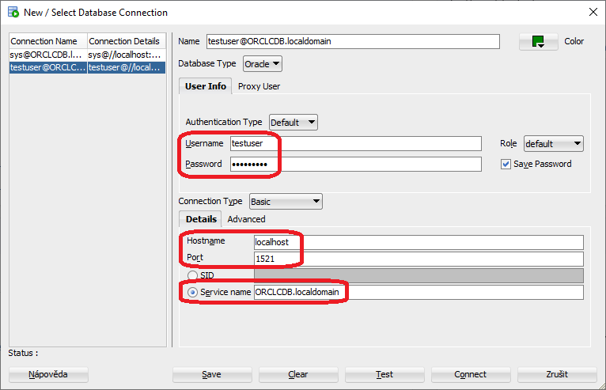

# Oracle database connection source codes
Small example console source codes how to connect to the Oracle database, how to update rows and how to read the table.

## Running under Windows
1. clone this repository to your computer
2. install the **Oracle database** (as a **Docker** container)
3. prepare the user, the table and rows in the database
4. build and run the example **Java** code
5. compile and run the example **.NET C#** code
6. run the example **PHP** code

### 1. Cloning to your computer
- install [GIT] on your computer
- clone this repository to your computer by the GIT command
  `git clone https://github.com/petrfaltus/oracle-database-connection-source-codes.git`

### 2. Installation of the Oracle database (as a Docker container)
- install [docker desktop] on your computer
- refer the [Oracle Database Enterprise Edition image]

The subdirectory `docker-database` contains prepared Windows batches:
- `01-run-database.cmd` - pulls the image (the download size is about 2GB) and runs the container **at the first time** (takes a time until ready)
- `02-switch-database-OFF.cmd` - stops the already existing container
- `02-switch-database-ON.cmd` - starts the already existing container (takes a time until ready)
- `03-inspect-database.cmd` - shows details for already existing container
- `04-exec-connection-to-database.cmd` - executes the **SQL Plus** terminal into running database container
- `containers.cmd` - lists currently running containers and list of all existing containers

### 3. Preparing the database
For the connection to the database use either the **SQL Plus** terminal or the [Oracle SQL Developer]

#### Connection using SQL Plus
User *sys* (default password *Oradoc_db1*)
```sql
CONNECT sys AS SYSDBA;
ALTER SESSION SET "_ORACLE_SCRIPT"=true;
```

User *testuser* (default password *T3stUs3r!*)
```sql
CONNECT testuser;
ALTER SESSION SET "_ORACLE_SCRIPT"=true;
```

#### Connection using SQL Developer
User *sys* (default password *Oradoc_db1*)



User *testuser* (default password *T3stUs3r!*)



#### SQL lines for sys
```sql
CREATE USER testuser IDENTIFIED BY "T3stUs3r!";
GRANT ALL PRIVILEGES TO testuser;
```

#### SQL lines for testuser
```sql
CREATE TABLE CARS
  (
   MANUFACTURER VARCHAR2(40 BYTE) NOT NULL,
   MODEL VARCHAR2(50 BYTE) NOT NULL,
   DOORS NUMBER(2,0) NOT NULL,
   CREATED TIMESTAMP(6) DEFAULT CURRENT_TIMESTAMP,
   UPDATED TIMESTAMP(6),
   REMARK VARCHAR2(80 BYTE),
   ID NUMBER(6,0) GENERATED ALWAYS AS IDENTITY START WITH 1 INCREMENT BY 1 NOT NULL,
   PRIMARY KEY (ID)
  );

CREATE OR REPLACE TRIGGER CARS_UPDATE
  BEFORE UPDATE ON CARS
  FOR EACH ROW
BEGIN
  :NEW.UPDATED := CURRENT_TIMESTAMP;
END;

INSERT INTO CARS (MANUFACTURER, MODEL, DOORS) VALUES ('Hyundai', 'Veloster', 3);
INSERT INTO CARS (MANUFACTURER, MODEL, DOORS) VALUES ('Skoda', 'Fabia', 5);
INSERT INTO CARS (MANUFACTURER, MODEL, DOORS) VALUES ('Volkswagen', 'Passat', 4);
INSERT INTO CARS (MANUFACTURER, MODEL, DOORS) VALUES ('Ford', 'Saloon', 4);
INSERT INTO CARS (MANUFACTURER, MODEL, DOORS) VALUES ('Ford', 'Focus', 5);

CREATE OR REPLACE PACKAGE CALCULATOR AS
  FUNCTION FACTORIAL(N INTEGER) RETURN INTEGER;
  PROCEDURE ADD_AND_SUBTRACT(A INTEGER, B INTEGER, X OUT INTEGER, Y OUT INTEGER);
END;
/

CREATE OR REPLACE PACKAGE BODY CALCULATOR AS
  FUNCTION FACTORIAL(N INTEGER) RETURN INTEGER IS
    RESULT INTEGER := 1;
  BEGIN
    IF N < 0 THEN
      RETURN -1;
    END IF;
    IF N < 2 THEN
      RETURN RESULT;
    END IF;
    FOR IJK IN 2 .. N LOOP
      RESULT := RESULT * IJK;
    END LOOP;
    RETURN RESULT;
  END;
  PROCEDURE ADD_AND_SUBTRACT(A INTEGER, B INTEGER, X OUT INTEGER, Y OUT INTEGER) IS
  BEGIN
    X := A + B;
    Y := A - B;
  END;
END;
/
```

#### optional SQL check lines for testuser
```sql
SELECT * FROM CARS;

SELECT COUNT(*) FROM CARS;
SELECT COUNT(*) FROM CARS WHERE ID!=1;

SELECT CALCULATOR.FACTORIAL(2) FROM DUAL;
SELECT CALCULATOR.FACTORIAL(3) FROM DUAL;
SELECT CALCULATOR.FACTORIAL(4) FROM DUAL;

SET serveroutput on;
DECLARE
  a INTEGER := 12;
  b INTEGER := 5;
  x INTEGER;
  y INTEGER;
BEGIN
  dbms_output.put_line('a = ' || a);
  dbms_output.put_line('b = ' || b);
  CALCULATOR.ADD_AND_SUBTRACT(a, b, x, y);
  dbms_output.put_line('x = ' || x);
  dbms_output.put_line('y = ' || y);
END;
/
```

### 4. The Java client source code
- install [Java JDK] on your computer
- set the OS environment `%JAVA_HOME%` variable (must exist `"%JAVA_HOME%\bin\java.exe"`)

#### 4.1. Apache Maven
- install [Apache Maven] on your computer
- add the Maven directory (where the batch `mvn.cmd` locates) to the OS environment `%PATH%` variable

The subdirectory `java-maven` contains prepared Windows batches:
- `01-build.cmd` - cleans, compiles and builds the Maven project
- `02-run.cmd` - runs the built Java archive (JAR)
- `03-clean.cmd` - cleans the Maven project

#### 4.2. Gradle Build Tool
- install [Gradle Build Tool] on your computer
- add the Gradle directory (where the batch `gradle.bat` locates) to the OS environment `%PATH%` variable

The subdirectory `java-gradle` contains prepared Windows batches:
- `01-build.cmd` - cleans, compiles and builds the Gradle project
- `02-run.cmd` - runs the built Java archive (JAR)
- `03-clean.cmd` - cleans the Gradle project

### 5. The .NET C# client source code
- use the `csc.exe` .NET C# compiler that is the part of Microsoft .NET Framework (part of OS)
- install [Oracle Data Provider for .NET] on your computer
- check the right `Oracle.ManagedDataAccess.dll` from [Oracle Data Provider for .NET] in the `csharp\bin` directory

The subdirectory `csharp` contains prepared Windows batches:
- `01-compile.cmd` - compiles the source code (contains the path definition to the `csc.exe` compiler)
- `02-run.cmd` - runs the Windows executable
- `03-clean.cmd` - deletes the Windows executable

### 6. The PHP client source code
- install [PHP] on your computer
- set the OS environment `%PHP_HOME%` variable (must exist `"%PHP_HOME%\php.exe"`)
- install [Microsoft Visual C++ Redistributable for Visual Studio 2015, 2017 and 2019]
- install [Oracle Instant Client]
- copy `oci.dll`, `oraociei19.dll` and `oraons.dll` from [Oracle Instant Client] to the PHP directory `%PHP_HOME%`

To the `php.ini` in the PHP directory `%PHP_HOME%` add lines
```
[PHP]
extension_dir = "ext"
extension=pdo_oci

[Date]
date.timezone = Europe/Prague
```

The subdirectory `php` contains prepared Windows batch:
- `01-run.cmd` - runs the code through the PHP interpreter

## Versions
Now in August 2020 I have the computer with **Windows 10 Pro 64bit**, **12GB RAM** and available **50GB free HDD space**

| Tool | Version | Setting |
| ------ | ------ | ------ |
| [GIT] | 2.26.0.windows.1 | |
| [docker desktop] | 2.3.0.4 (46911) stable | 2 CPUs, 3GB memory, 1GB swap, 48GB disc image size |
| [Oracle Database Enterprise Edition image] | 12.2.0.1 | default password for sys: Oradoc_db1 |
| [Oracle SQL Developer] | 20.2.0 | |
| [Java JDK] | 14.0.1 | Java(TM) SE Runtime Environment (build 14.0.1+7) |
| [Apache Maven] | 3.6.3 | |
| [Gradle Build Tool] | 6.3 | |
| .NET C# compiler | 4.8.3752.0 | |
| [Oracle Data Provider for .NET] | 12.2 | ODP.NET_Managed_ODAC122cR1.zip |
| [PHP] | 7.4.4 | 7.4.4-nts-Win32-vc15-x64 |
| [Microsoft Visual C++ Redistributable for Visual Studio 2015, 2017 and 2019] | | VC_redist.x64.exe |
| [Oracle Instant Client] | 19.6.0.0.0 | instantclient-basic-windows.x64-19.6.0.0.0dbru.zip |

## To do (my plans to the future)


[GIT]: <https://git-scm.com>
[docker desktop]: <https://docs.docker.com/desktop/>
[Oracle Database Enterprise Edition image]: <https://hub.docker.com/_/oracle-database-enterprise-edition>
[Oracle SQL Developer]: <https://www.oracle.com/database/technologies/appdev/sqldeveloper-landing.html>
[Java JDK]: <https://www.oracle.com/java/technologies/javase-downloads.html>
[Apache Maven]: <https://maven.apache.org/>
[Gradle Build Tool]: <https://gradle.org/>
[Oracle Data Provider for .NET]: <https://www.oracle.com/cz/database/technologies/appdev/dotnet/odp.html>
[PHP]: <https://www.php.net/>
[Microsoft Visual C++ Redistributable for Visual Studio 2015, 2017 and 2019]: <https://support.microsoft.com/en-us/help/2977003/the-latest-supported-visual-c-downloads>
[Oracle Instant Client]: <https://www.oracle.com/database/technologies/instant-client/downloads.html>
